<!-- Generated by scripts/card_layout.py; card dimensions come from the source SVGs. -->
<picture>
  <source media="(max-width: 823.85px)" srcset="assets/readme-cards/overview-narrow-c6a848b01f59876e.svg" />
  
</picture>
