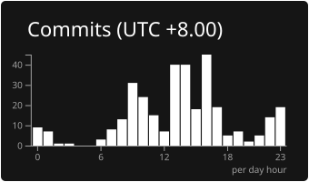

<!-- GitHub Stats -->

  <!-- GitHub Stats Card -->
  
  
  <!-- Top Languages Card -->
  

<!-- GitHub Streak and Productive Time -->

  <!-- GitHub Streak -->
  
  
  <!-- Productive Time -->
  

